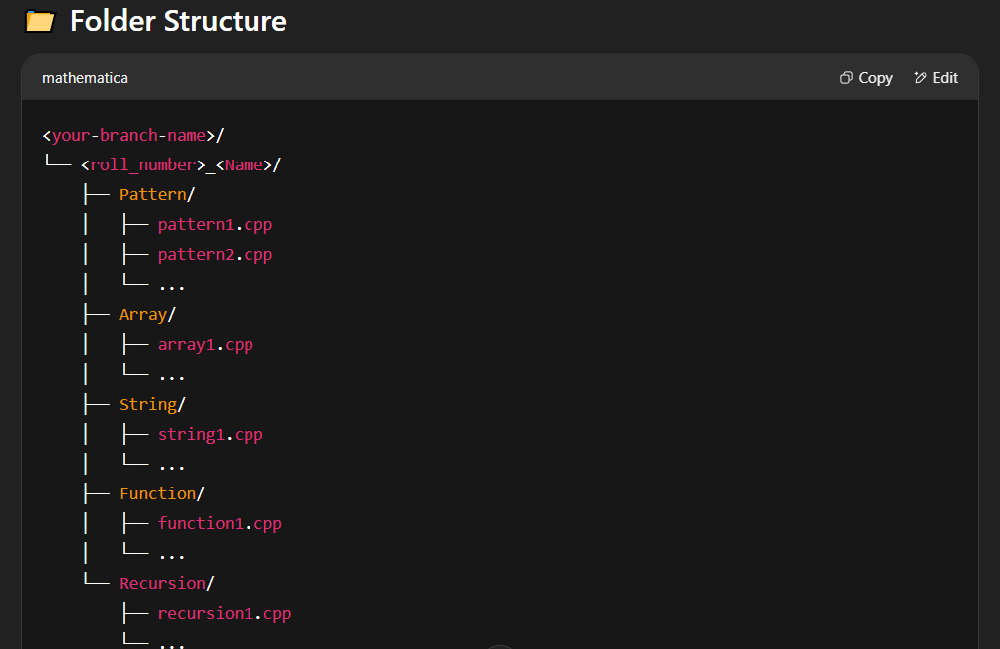

# 📘 Assignment Submission Guidelines

Welcome to the **Crazy Coders Assignment Repository**! 🎯

To ensure consistency and easy tracking, **please follow the structure and naming conventions mentioned below** when submitting your assignments.

---

---

## 📝 Naming Conventions

- **Branch**: Use the branch assigned to you by your instructor or coordinator.
- **Folder**: Name your personal folder as `RollNumber_Name` (e.g., `23_AkashKanni`).
- **Files**: Name each file meaningfully (e.g., `pattern1.cpp`, `array2.cpp`).

---

## ✅ Topics to Submit

- 🔹 **Pattern Problems** – 25 Programs  
- 🔹 **Array** – 10 Programs  
- 🔹 **String** – 10 Programs  
- 🔹 **Function** – 5 Programs  
- 🔹 **Recursion** – 5 Programs  

Please make sure to keep your code **well-commented and readable**.

---

## 💡 Notes

- Refer to class notes & sample code here:  
  🔗 [VVP-TY Reference Repo](https://github.com/CrazyCoders001/VVP-TY)

- If you face any issues or have doubts, feel free to **reach out on the WhatsApp group**.

---

Thanks for following the structure and happy coding!  
Let’s make this repo clean and collaborative! 🚀👨‍💻👩‍💻

